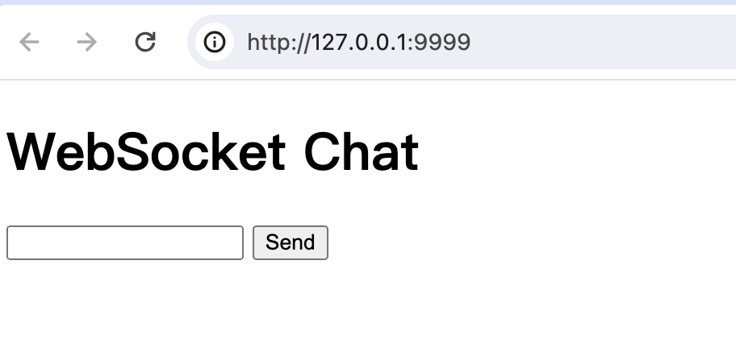
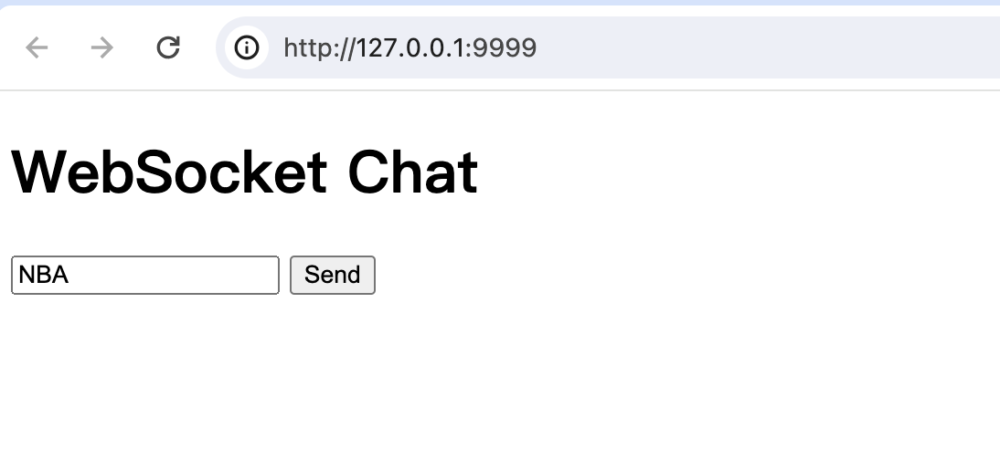
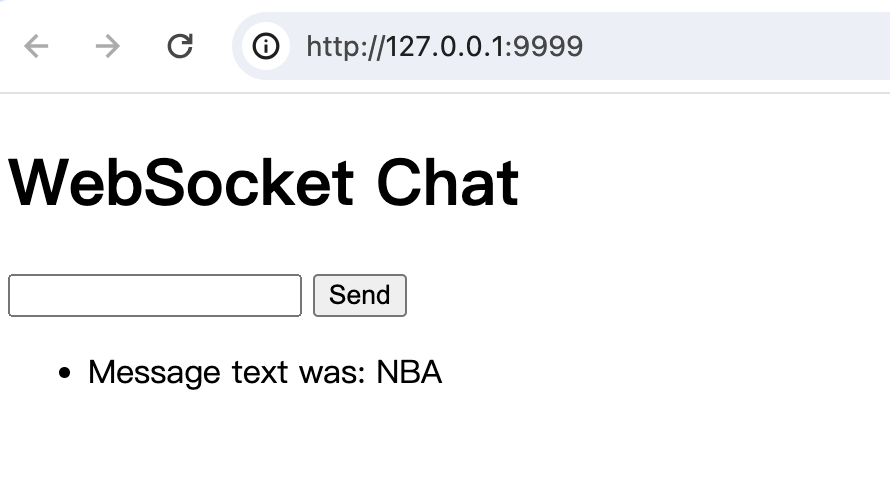
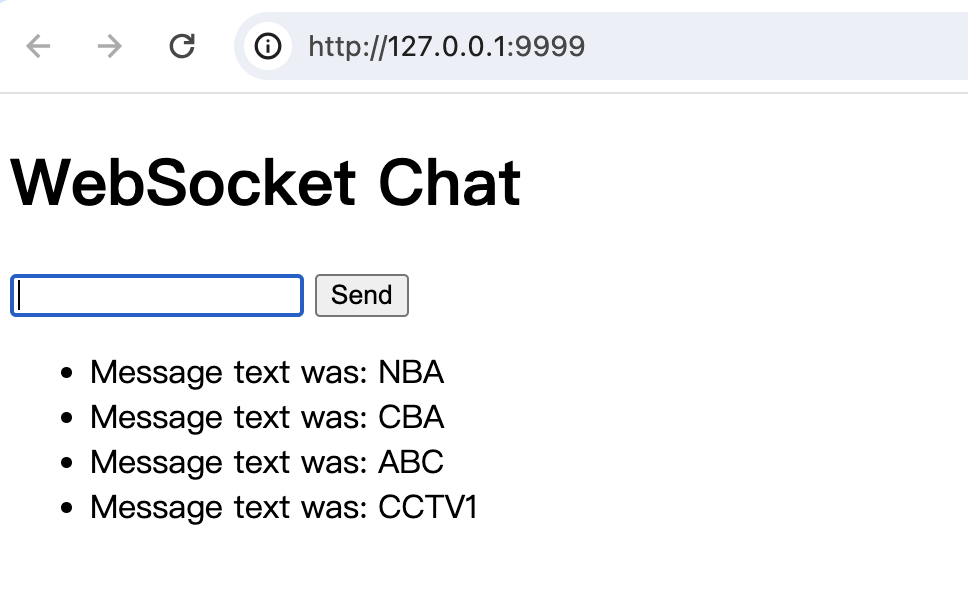

## 导读

在 `FastAPI` 中也可以使用 `WebSockets`。

## 首先要安装依赖WebSockets

```bash
pip install websockets
```

## 举例进行测试

`WebSockets` 需要有一个前端发送消息，后端处理消息再发送消息给前端。

前端可以是简单的`html`页面，可以是`React`, `Vue.js` or `Angular`框架写的前端，也可以是手机`APP`移动端。

下面的例子中，采用简单的`html`页面，在加上`js`来实现发送消息的逻辑。

### 1. html页面

```html
<!DOCTYPE html>
<html>
    <head>
        <title>Chat</title>
    </head>
    <body>
        <h1>WebSocket Chat</h1>
        <form action="" onsubmit="sendMessage(event)">
            <input type="text" id="messageText" autocomplete="off"/>
            <button>Send</button>
        </form>
        <ul id='messages'>
        </ul>
        <script>
            var ws = new WebSocket("ws://localhost:8000/ws");
            ws.onmessage = function(event) {
                var messages = document.getElementById('messages')
                var message = document.createElement('li')
                var content = document.createTextNode(event.data)
                message.appendChild(content)
                messages.appendChild(message)
            };
            function sendMessage(event) {
                var input = document.getElementById("messageText")
                ws.send(input.value)
                input.value = ''
                event.preventDefault()
            }
        </script>
    </body>
</html>
```

以上例子解析：
1. `form`标签：定义了当点击提交按钮时，发送消息：`sendMessage(event)`
2. `sendMessage`方法：首先获取输入框，再将输入框中的内容发送出去，再将输入框中内容置空，设置防止事件。
3. `ws.onmessage`：监听`message`消息，将事件消息内容呈现到页面上。

### 2. 返回html页面视图

```python
@app.get("/")
async def get():
    return HTMLResponse(html)
```

### 3. WebSockets处理视图

```python
@app.websocket("/ws")
async def websocket_endpoint(websocket: WebSocket):
    await websocket.accept()
    while True:
        data = await websocket.receive_text()
        await websocket.send_text(f"Message text was: {data}")
```

以上例子解析：
1. 请求参数定义对象：`WebSocket`
2. `await websocket.accept()`跟客户端建立连接。
3. `await websocket.receive_text()` 接收客户端消息。
4. `await websocket.send_text(f"Message text was: {data}")` 发送消息给客户端。

## 运行代码，测试

完整代码：
```python
from fastapi import FastAPI, WebSocket
from fastapi.responses import HTMLResponse

app = FastAPI()

html = """
<!DOCTYPE html>
<html>
    <head>
        <title>Chat</title>
    </head>
    <body>
        <h1>WebSocket Chat</h1>
        <form action="" onsubmit="sendMessage(event)">
            <input type="text" id="messageText" autocomplete="off"/>
            <button>Send</button>
        </form>
        <ul id='messages'>
        </ul>
        <script>
            var ws = new WebSocket("ws://127.0.0.1:9999/ws");
            ws.onmessage = function(event) {
                var messages = document.getElementById('messages')
                var message = document.createElement('li')
                var content = document.createTextNode(event.data)
                message.appendChild(content)
                messages.appendChild(message)
            };
            function sendMessage(event) {
                var input = document.getElementById("messageText")
                ws.send(input.value)
                input.value = ''
                event.preventDefault()
            }
        </script>
    </body>
</html>
"""


@app.get("/")
async def get():
    return HTMLResponse(html)


@app.websocket("/ws")
async def websocket_endpoint(websocket: WebSocket):
    await websocket.accept()
    while True:
        data = await websocket.receive_text()
        await websocket.send_text(f"Message text was: {data}")

```

运行程序：
```bash
uvicorn main:app --reload --port 9999

INFO:     Uvicorn running on http://127.0.0.1:9999 (Press CTRL+C to quit)

```

浏览器中请求地址：`http://127.0.0.1:9999`:


输入框中输入：`NBA`


点击发送：


多次发送测试：



## 结语

以上代码都是在 python3.9 版本进行测试的。  

本节介绍了`websocket`的简单使用，基本用法，下节将介绍`ws`的认证。


***

每日踩一坑，生活更轻松。

本期分享就到这里啦，祝君在测开之路上越走越顺，越走越远。

gzh：`测开工程师的烦恼`